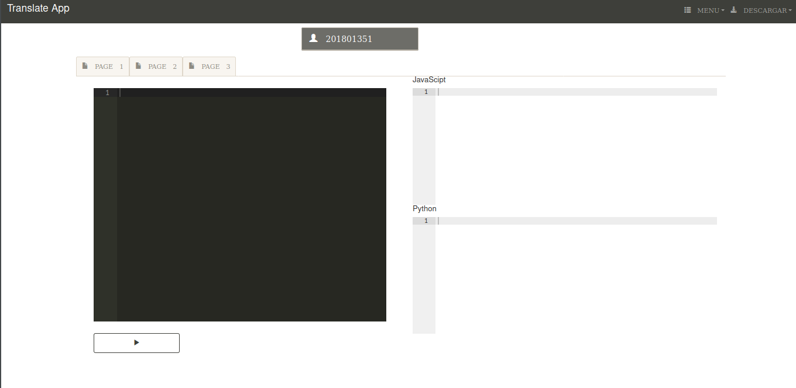

# Proyecto No.2 con Docker 
## Universidad de San Carlos de Guatemala
### Organizacion de Lenguajes y Compiladores 1
### Ing.Mauel Castillo
### Aux.Huriel
## **Manual de Usuario**
### Elmer Gustavo Sanchez Garcia
### **201801351**
### Fecha de Entrega: 6 de noviembre de 2020

---

### Pantalla Principla

Como se puede observar este es una aplicacion web, la parte de la interfaz y todo lo que interactua con el cliente esta realizada con ***Go,html,javascript***, en la imagen se puede obeservar.

### Barra de navegacion

En la barra de navegacion o "nav" se puede observar el titulo de la aplicacion, tambien encontramos dos submenus:

* **MENU**
    * **Abrir:** Esta opcion funciona para abrir archivos que tenga en su computador y lo proyectara en en la consola de entrada.

    * **Nuevo:** Esta opcion es para crear un nuevo archivo.

    * **Guardar:** Esta opcion sirve solo para guardar la respuesta generada por los servidores.

    * **Guardar Como:** Esta opcion funciona para darle un nombre al archivo y guardarlo.

* **Descargar**
    * **JavaScript:** Sirve para descargar la respuesta generada del servidor pero solo para javascript.

    * **Reporte Js:** Sirve para el reporte de JavaScript pera para los token generados por el servidor.

### Consola de Entrada

Esta es la encargada de leer lo que el usuario escriba en ella o informacion cuando se leea algun archivo de entrada del computador.

## Consolas de Salidas

Esta son las salidas de la consola de entrada, son las respuestas generadas por el serviodor para su respectivo lenguaje JavaScript y Python. Aqui se mostran los erroes o los el texto traducio,tambien los token para python.

